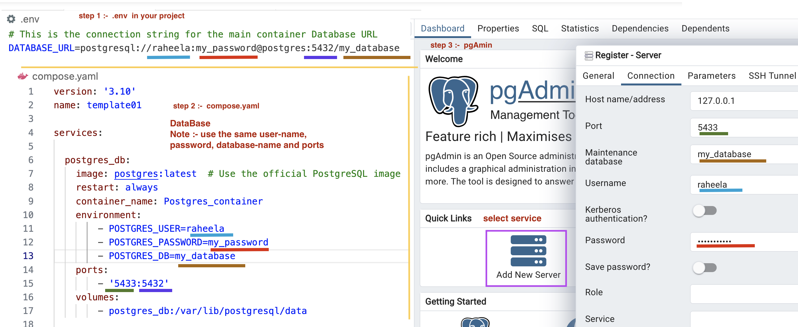
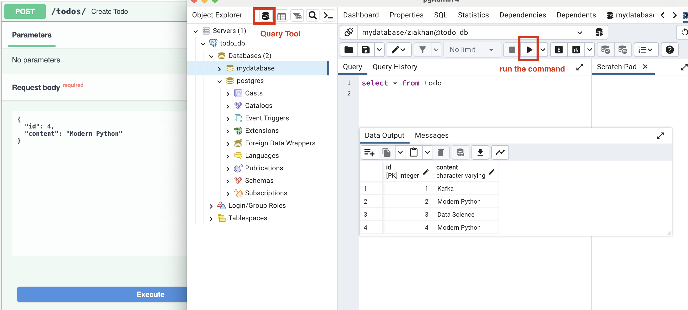

## Todo Api (Docker Compose with Database Service)

**add poetry drivers** (one line command)
```shell
poetry add fastapi sqlmodel uvicorn\[standard\] psycopg 
```

**==========================================**

 **build new image** 
```shell
 docker compose up -d 
```
build the image and starts the container in detached mode 

Note :- -d, --detach  (Detached mode: Run containers in the background)

 **rebuild the image** 
  ```shell
 docker compose up -d --build 
```
(recreate the image —> - - build)

**container detail** 
 ```shell
 docker compose config 
```

**stop running container**
```shell
 docker compose stop

 docker stop {OPTIONS} containerID/container_name
```

**restart container**
  ```shell
 docker restart container_name/container_id
```

**stops and removes the container**
```shell
 docker compose down
```
1. Stop all containers
2. Remove all containers
3. Remove all networks

**view logs** 
 ```shell
 docker-compose logs service-name
```

**view logs (real-time monitoring)**
 ```shell
 docker-compose logs service-name -f
```
- f  (follow)(real-time.) (give all the command running on terminal)
  
**display container** 
 ```shell
 docker compose ps 

 docker ps {OPTIONS}
```
-a flag:  shows us all the containers, stopped or running. {-a: Stands for "all"}

-l flag: shows us the latest container.

-q flag: shows only the Id of the containers. 

display : NAME ,  IMAGE,   COMMAND,  SERVICE,  CREATED , STATUS ,  PORTS
    
 **container list**
```bash
 docker compose ls 

 docker container ls {OPTIONS}

 docker container  ls -a
```
display containers :-  NAME  - STATUS  -  CONFIG FILES
-a : all  (list of all containers, both running and stopped)

**forcefully stop running container** 
 ```shell
 docker kill containerID/container_name 

 docker kill {OPTIONS} containerID/container_name 
```

### pgAdmin

<div style="text-align: center;">
    </img>
</div>

### Query Tool

<div style="text-align: center;">
    </img>
</div>


**video**

(Portobuf)
GenAI Quarter 5 Online Class 14: Protobuf in Kafka & Introduction to Kong - An API Gateway
https://www.youtube.com/watch?v=nMXMV48EiQA

GenAI Quarter 5 Online Class 13: Serialization and Deserialization Kafka Messages
https://www.youtube.com/watch?v=qVbAYHxW3xg

(Pg Admin)
GenAI Quarter 5 Online Class 08: Docker Compose - Running Multi Containers with Docker Compose
https://www.youtube.com/watch?v=l5eZMAhDwhQ&t=3117s

GenAI Quarter 5 Online Class 07: Docker Compose - Orchestrate Multi-Container Applications with Ease
https://www.youtube.com/watch?v=cpu44VE_J1I&t=5554s 

(Dev Container)
Dev Container Online Class 06: What is Dev Container (Development inside Containers) - Docker
https://www.youtube.com/watch?v=h32qw986-tI


**Github**


Docker Compose with Database Service (Github)
https://github.com/panaverse/learn-generative-ai/tree/main/05_microservices_all_in_one_platform/14_docker/05_compose_db

kafka_messaging (Github)
https://github.com/panaverse/learn-generative-ai/tree/main/05_microservices_all_in_one_platform/15_event_driven/02_kafka_messaging

Protobuf Kafka Messaging (Github)
https://github.com/panaverse/learn-generative-ai/tree/main/05_microservices_all_in_one_platform/15_event_driven/03_protobuf

# docker_compose_db
